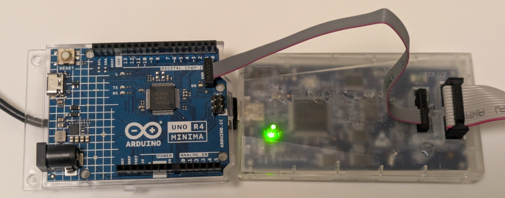

# Arduino_UNO_R4_Minima_assembly_various_programs
Arduino UNO R4 Minimaをアセンブリ言語で動かしてみました。

手順は以下の通りです。Windowsでやりました。

- batファイルを実行してmotファイルを作る。asmは同じディレクトリ。
- E2 LiteとArduino_UNO_R4_MinimaをSWD接続。
- Renesas Flash Programmerで書き込み
- ケーブルを外す
- USBケーブルを繋いで電源供給し、動作確認する。

## SWD接続ケーブル

秋月電子通商で買ったケーブル（確か、販売コード 106777、106776）を改造して作りました。

